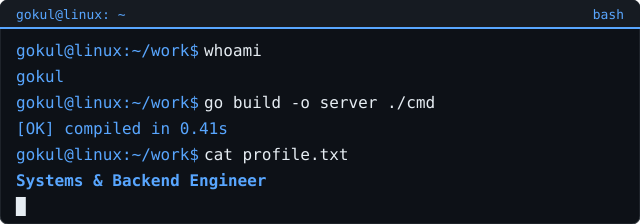

<pre style="color:#58a6ff;font-family:monospace;font-weight:bold;font-size:16px;line-height:1.15;margin:0;">
   __________  __ ____  ____ 
  / ____/ __ \/ //_/ / / / / 
 / / __/ / / / ,< / / / / /  
/ /_/ / /_/ / /| / /_/ / /___
\____/\____/_/ |_\____/_____/
                             
</pre>

<pre style="margin:0;font-family:inherit;font-size:inherit;white-space:pre-wrap;line-height:1.6;">
gokul@linux:~/work$ whoami
gokul

gokul@linux:~/work$ cat ~/about.txt
Third-year B.Tech Computer Science student who prefers going deep — systems programming in C/C++, backend services in Go and Java, and developer tooling. Linux daily driver, TUI over GUI. When the terminal is closed, I am reading manhwa and web novels.

gokul@linux:~/work$ cat ~/skills.txt
languages:   C    C++    Go    Java    Python    TypeScript    JavaScript
backend:     Go (Cobra, stdlib)    Express.js    Spring Boot
frontend:    React    TypeScript
systems:     Linux    TUI/CLI tooling    Git    GitHub Actions
ai/ml:       TensorFlow    PyTorch    scikit-learn    Streamlit

gokul@linux:~/work$ ls ~/projects/
<a href="https://github.com/gokul1063/Gcode" style="color:#e6edf3;">Gcode/</a>                AI coding assistant with vim, LSP and MCP          (Go)
<a href="https://github.com/gokul1063/java-server" style="color:#e6edf3;">java-server/</a>          video streaming, proxy caching, TCP congestion       (Java)
<a href="https://github.com/gokul1063/hotreload" style="color:#e6edf3;">hotreload/</a>            watch files, rebuild + restart your server           (Go)
<a href="https://github.com/gokul1063/micro" style="color:#e6edf3;">micro/</a>                low-level systems experiments                        (C)
<a href="https://github.com/gokul1063/mechanicalKeyboard" style="color:#e6edf3;">mechanicalKeyboard/</a>   global keystroke sound simulation                   (C)
<a href="https://github.com/gokul1063/uuid-ts" style="color:#e6edf3;">uuid-ts/</a>              snowflake ID generator for distributed systems       (TypeScript)
<a href="https://github.com/gokul1063/gitCloner" style="color:#e6edf3;">gitCloner/</a>            git history analyzer, rebuild a repo commit-by-commit (Go)
<a href="https://github.com/gokul1063/Leetcode_Solutions" style="color:#e6edf3;">Leetcode_Solutions/</a>   competitive programming solutions                     (C++)
</pre>

<pre style="margin:0;font-family:inherit;font-size:inherit;white-space:pre-wrap;line-height:1.6;">
gokul@linux:~/work$ cat ~/currently.txt
- building distributed systems and backend services
- exploring blockchain, LSPs and compiler tooling
- writing TUIs instead of websites

gokul@linux:~/work$ cat ~/interests.txt
- reading web novels and manhwa
- tuning Linux and collecting ASCII art
- going down rabbit holes about how things work underneath

gokul@linux:~/work$ ./github-stats
</pre>

<pre style="margin:0;font-family:inherit;font-size:inherit;white-space:pre-wrap;line-height:1.6;">
gokul@linux:~/work$ cat ~/contact.txt
email:      <a href="mailto:gokulrajeshkumar1063@gmail.com" style="color:#e6edf3;">gokulrajeshkumar1063@gmail.com</a>
linkedin:   <a href="https://www.linkedin.com/in/gokulrajeshkumar1063/" style="color:#e6edf3;">linkedin.com/in/gokulrajeshkumar1063</a>
portfolio:  <a href="https://portfolio-gokul.netlify.app/" style="color:#e6edf3;">portfolio-gokul.netlify.app</a>

gokul@linux:~/work$ █
</pre>

