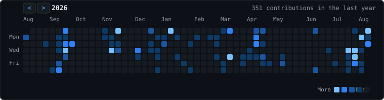

<pre style="color:#58a6ff;font-family:monospace;font-weight:bold;font-size:16px;line-height:1.15;margin:0;">
   __________  __ ____  ____ 
  / ____/ __ \/ //_/ / / / / 
 / / __/ / / / ,< / / / / /  
/ /_/ / /_/ / /| / /_/ / /___
\____/\____/_/ |_\____/_____/
                             
</pre>

<pre style="margin:0;font-family:inherit;font-size:inherit;white-space:pre-wrap;line-height:1.6;">
gokul@linux:~/work$ whoami
gokul

gokul@linux:~/work$ cat ~/about.txt
# ~/about.txt
name:      gokul
role:      systems &amp; backend engineer
focus:     systems programming (C/C++), backend (Go, Java), tooling
setup:     linux daily driver, TUI over GUI
education: B.Tech Computer Science, 3rd year
downtime:  manhwa and web novels

gokul@linux:~/work$ tree ~/stack
.
├── languages
│   ├── c
│   ├── c++
│   ├── go
│   ├── java
│   ├── python
│   ├── typescript
│   └── javascript
├── backend
│   ├── go (stdlib, cobra)
│   ├── express.js
│   └── spring boot
├── frontend
│   └── react
├── systems
│   ├── linux
│   ├── tui / cli tooling
│   └── git
└── ai-ml
    ├── tensorflow
    ├── pytorch
    ├── scikit-learn
    └── streamlit

gokul@linux:~/work$ ls ~/projects/
<a href="https://github.com/gokul1063/micro" style="color:#e6edf3;">micro/</a>        low-level systems experiments                  (C)
<a href="https://github.com/gokul1063/java-server" style="color:#e6edf3;">java-server/</a>  video streaming, proxy caching, TCP congestion (Java)
<a href="https://github.com/gokul1063/devsync" style="color:#e6edf3;">devsync/</a>      dev environment capture and replay tool        (Go)</pre>

<pre style="margin:0;font-family:inherit;font-size:inherit;white-space:pre-wrap;line-height:1.6;">
gokul@linux:~/work$ cat ~/currently.txt
- building distributed systems and backend services
- exploring blockchain, LSPs and compiler tooling
- writing TUIs instead of websites

gokul@linux:~/work$ cat ~/interests.txt
- reading web novels and manhwa
- tuning Linux and collecting ASCII art
- going down rabbit holes about how things work underneath
</pre>

<pre style="margin:0;font-family:inherit;font-size:inherit;white-space:pre-wrap;line-height:1.6;">
gokul@linux:~/work$ ./contrib --color=blue --year=2026
</pre>

<pre style="margin:0;font-family:inherit;font-size:inherit;white-space:pre-wrap;line-height:1.6;">
gokul@linux:~/work$ cat ~/contact.txt
email:      <a href="mailto:gokulrajeshkumar1063@gmail.com" style="color:#e6edf3;">gokulrajeshkumar1063@gmail.com</a>
linkedin:   <a href="https://www.linkedin.com/in/gokulrajeshkumar1063/" style="color:#e6edf3;">linkedin.com/in/gokulrajeshkumar1063</a>
portfolio:  <a href="https://portfolio-gokul.netlify.app/" style="color:#e6edf3;">portfolio-gokul.netlify.app</a>

gokul@linux:~/work$ █
</pre>

